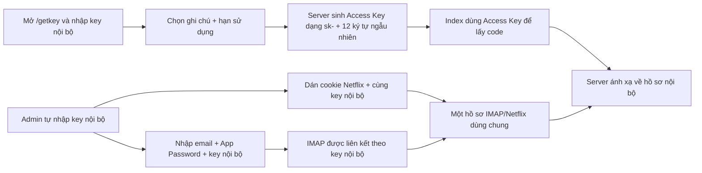
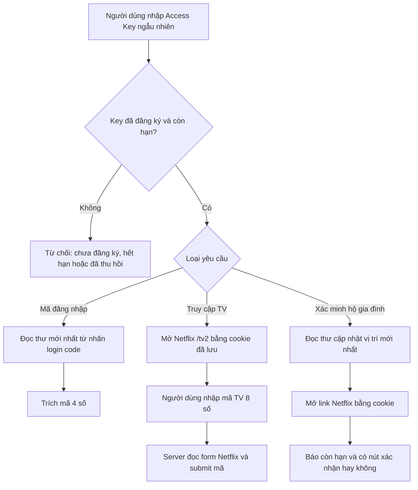

# Netflix Mail Admin

Ứng dụng Node.js/Express gồm ba giao diện:

- Trang người dùng để lấy mã đăng nhập, kiểm tra luồng xác minh hộ gia đình và nhập mã TV.
- Trang quản trị để cấu hình IMAP, quản lý phiên Netflix và kiểm tra liên kết.
- Trang `getkey` để admin đăng ký, gia hạn và thu hồi Access Key có thời hạn.

> Đây là công cụ nội bộ dùng luồng web/IMAP. Netflix có thể thay đổi HTML, cookie hoặc cơ chế chống bot bất kỳ lúc nào, vì vậy các thao tác phân tích trang chỉ mang tính heuristic.

## Yêu cầu

- Node.js 20.18 trở lên.
- Tài khoản email đã bật IMAP. Với Gmail, sử dụng App Password thay cho mật khẩu chính.
- Cookie Netflix hợp lệ cho các luồng cần phiên đăng nhập.

## Cài đặt lần đầu

```powershell
npm install
npm run setup
npm run dev
```

`npm run setup` tạo `.env` với mật khẩu admin và khóa mã hóa ngẫu nhiên. Lệnh không ghi đè nếu `.env` đã tồn tại.

Mặc định server chỉ nghe tại `127.0.0.1:3000`:

- Người dùng: <http://127.0.0.1:3000/>
- Quản trị: <http://127.0.0.1:3000/p8xK29panel/>
- Quản lý key: <http://127.0.0.1:3000/getkey/>
- Health check: <http://127.0.0.1:3000/api/health>

Khi mở trang quản trị, ứng dụng hiển thị màn hình đăng nhập riêng. Username/password nằm trong `.env` qua `ADMIN_USERNAME` và `ADMIN_PASSWORD`. Sau khi đăng nhập, server cấp session cookie `HttpOnly`, `SameSite=Strict`; giao diện tự quay lại màn hình đăng nhập khi phiên hết hạn.

Trang `/getkey/` hoạt động độc lập với dashboard admin: chỉ yêu cầu Key liên kết IMAP/Netflix đã cấu hình trong Admin, không cần username, mật khẩu admin hoặc đăng nhập admin trước. GetKey sử dụng cookie session và CSRF token riêng, được giới hạn theo đúng hồ sơ IMAP của key đăng nhập.

## Cấu hình

Sao chép `.env.example` nếu muốn tự cấu hình thay vì chạy `npm run setup`.

| Biến | Bắt buộc | Mặc định | Ý nghĩa |
| --- | --- | --- | --- |
| `ADMIN_USERNAME` | Có | `admin` | Tên đăng nhập quản trị. |
| `ADMIN_PASSWORD` | Có | Không | Mật khẩu admin, tối thiểu 12 ký tự. |
| `DATA_ENCRYPTION_KEY` | Có | Không | Khóa mã hóa dữ liệu, tối thiểu 32 ký tự. |
| `ADMIN_SESSION_HOURS` | Không | `8` | Thời hạn phiên đăng nhập admin. |
| `ADMIN_LOGIN_RATE_LIMIT` | Không | `10`/15 phút | Số lần đăng nhập sai tối đa cho mỗi IP. |
| `ADMIN_COOKIE_SECURE` | Không | `false` | Đặt `true` khi chạy production qua HTTPS. |
| `HOST` | Không | `127.0.0.1` | Địa chỉ server lắng nghe. |
| `PORT` | Không | `3000` | Cổng HTTP. |
| `IMAP_HOST` | Không | `imap.gmail.com` | Máy chủ IMAP. |
| `IMAP_PORT` | Không | `993` | Cổng IMAP. |
| `IMAP_SECURE` | Không | `true` | Dùng TLS cho IMAP. |
| `NETFLIX_SESSION_FILE` | Không | `data/netflix-session.json` | Nơi lưu dữ liệu runtime. |
| `ACCESS_KEYS_FILE` | Không | `data/access-keys.json` | Kho bản băm và hạn sử dụng của Access Key. |
| `PUBLIC_RATE_LIMIT` | Không | `30`/phút | Giới hạn mỗi IP cho API người dùng. |
| `ADMIN_RATE_LIMIT` | Không | `500`/15 phút | Giới hạn mỗi IP cho trang/API admin. |
| `TRUST_PROXY` | Không | `false` | Chỉ bật khi đứng sau reverse proxy tin cậy. |

Không được thay đổi hoặc làm mất `DATA_ENCRYPTION_KEY` sau khi đã lưu session. Nếu thay khóa, dữ liệu cũ không thể giải mã.

## Luồng cấu hình quản trị



1. Đăng nhập dashboard Admin. Trong tab **Thư IMAP**, tự nhập key nội bộ 16–80 ký tự cùng email và App Password. Key liên kết này không được random và không đưa cho người dùng.
2. Đăng nhập IMAP để lưu liên kết. Trong tab **Phiên Netflix**, dán cookie và dùng đúng key nội bộ đó để gom IMAP/Netflix vào cùng một hồ sơ.
3. Mở `/getkey/` và nhập Key liên kết IMAP/Netflix; không cần mật khẩu hoặc phiên đăng nhập dashboard admin. Server chỉ cho vào khi key thực sự đã có cấu hình IMAP.
4. Nhập tên/ghi chú và chọn hạn sử dụng. GetKey luôn sinh một **Access Key dạng `sk-` + 12 ký tự ngẫu nhiên** liên kết với IMAP của phiên hiện tại.
5. Sao chép Access Key vừa tạo ngay. Chỉ Access Key này được đưa cho người dùng và nhập tại trang index.
6. Khi người dùng lấy code, server kiểm tra Access Key còn hạn/chưa thu hồi, sau đó ánh xạ về key nội bộ để chọn đúng IMAP và cookie Netflix.

Admin có thể cấu hình nhiều tài khoản IMAP, mỗi tài khoản dùng một key liên kết riêng. Danh sách phiên trong Admin thống kê theo từng key: tổng Access Key GetCode đã tạo, số đang hoạt động, hết hạn, đã thu hồi và tổng lượt sử dụng. Nút **Làm Mới Thống Kê** tải lại số liệu từ server.

Hai loại key không thay thế cho nhau: key nội bộ chỉ dùng để liên kết tài khoản trong Admin/GetKey; Access Key dạng `sk-xxxxxxxxxxxx` chỉ dùng ở trang index. Có thể tạo nhiều Access Key với hạn khác nhau cùng trỏ tới một hồ sơ nội bộ.

Hai giao diện được tách độc lập: Admin nằm trong `public/p8xK29panel`, GetKey nằm trong `public/getkey`; không có nút Dashboard/Quản lý Key liên kết qua lại. GetKey dùng session riêng theo Key liên kết và chỉ xem/sửa/thu hồi Access Key thuộc đúng hồ sơ đó.

Trình duyệt chỉ nhớ email và key để điền nhanh; App Password không được lưu trong `localStorage`. Server lưu cookie và App Password bằng AES-256-GCM trong `data/netflix-session.json`.
Registry `data/access-keys.json` chỉ lưu SHA-256 của Access Key và lưu key nội bộ ở dạng AES-256-GCM; API quản lý chỉ trả về bản xem trước đã che.

## Luồng người dùng



### Mã đăng nhập

Server kiểm tra Access Key, ánh xạ sang key nội bộ rồi tìm session, dùng IMAP đã lưu, mở nhãn mã đăng nhập, đọc thư mới nhất và trích mã 4 số. URL trong email được loại khỏi vùng dò để tránh nhầm số trong token.

### Truy cập TV

Server dùng cookie của key để mở `/tv2`. Nếu phiên còn hợp lệ, giao diện yêu cầu mã TV 8 số. Khi gửi mã, server đọc hidden fields/authURL từ form Netflix rồi submit và phân tích trang kết quả.

### Xác minh hộ gia đình

Server đọc thư mới nhất trong nhãn cập nhật hộ gia đình, lấy link `netflix.com`, mở link bằng cookie đã lưu và báo link còn hiệu lực/có nút xác nhận hay không. Ứng dụng không tự động click xác nhận trong luồng này.

## Phân quyền API

- Công khai nhưng có rate limit: `GET /api/health`, `POST /api/get-code`, `POST /api/submit-tv-code`.
- Màn hình đăng nhập: `/p8xK29panel/*`; trang không chứa dữ liệu quản trị trước khi xác thực.
- Session admin: `/api/admin/login`, `/api/admin/session`, `/api/admin/logout`.
- Session GetKey độc lập: `/api/getkey/login`, `/api/getkey/session`, `/api/getkey/logout`; đăng nhập chỉ bằng Key liên kết IMAP/Netflix, không dùng mật khẩu admin.
- Quản lý Access Key: `/api/keys/*`, bắt buộc session GetKey và CSRF riêng, tự giới hạn dữ liệu theo Key liên kết của phiên và không chấp nhận session dashboard admin.
- Bắt buộc session admin: toàn bộ `/api/imap/*` và các thao tác quản lý session `/api/netflix/*`; các API này nhận key nội bộ, không yêu cầu Access Key công khai.
- API người dùng `/api/get-code` và `/api/submit-tv-code` kiểm tra hạn Access Key rồi ánh xạ đến hồ sơ IMAP/Netflix nội bộ.
- API trả `Cache-Control: no-store`; server bật CSP, chống MIME sniffing, clickjacking và các security headers phổ biến.

## Kiểm tra trước khi chạy

```powershell
npm run check
npm test
npm audit
```

Bộ test kiểm tra health endpoint, security headers, đăng nhập, cookie, CSRF, đăng xuất, ánh xạ hai loại key, sinh key ngẫu nhiên, ẩn plaintext/thu hồi key, từ chối key chưa đăng ký, mã hóa secrets và JSON 404.

## Triển khai

Mặc định chỉ dùng local. Nếu cần truy cập qua mạng:

1. Đặt ứng dụng sau reverse proxy có HTTPS.
2. Chỉ khi đó mới đổi `HOST=0.0.0.0`.
3. Đặt `ADMIN_COOKIE_SECURE=true` để cookie đăng nhập chỉ được gửi qua HTTPS.
4. Đặt `TRUST_PROXY=true` nếu proxy là thành phần tin cậy và đã chặn truy cập trực tiếp vào Node.
5. Dùng mật khẩu/khóa mạnh, backup `.env` và file session ở nơi bảo mật.
6. Không commit `.env`, session, private key hoặc bản backup chứa secrets.

## Lưu ý về secrets cũ

Repository trước đây từng chứa SSH private key và cookie Netflix. Các file hiện đã được bỏ khỏi phiên bản mới và bị Git ignore, nhưng dữ liệu vẫn có thể tồn tại trong lịch sử commit cũ. Cần thu hồi key/cookie cũ; nếu repository từng được chia sẻ, dùng quy trình rewrite history riêng rồi force-push có phối hợp với các thành viên khác.
